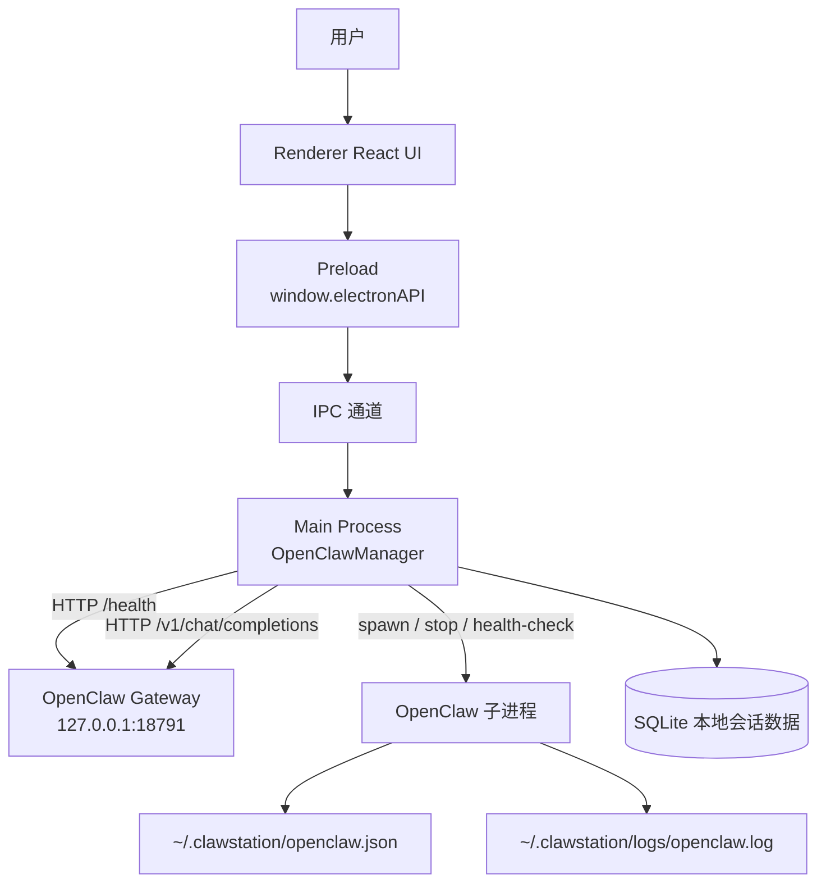
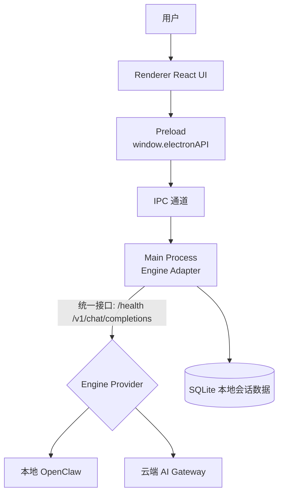

# ClawStation - AI数字员工桌面应用

[English](./README_EN.md) | [中文](./README.md)

## 项目概述

ClawStation 是一个跨平台的 AI 数字员工桌面应用，基于 Electron 框架开发，内置 OpenClaw AI 引擎。用户安装应用后即可直接使用 AI 对话功能，无需配置额外环境。

## 核心特性

- **开箱即用** - 安装即可使用，无需配置环境
- **内置 AI 引擎** - 集成 OpenClaw，支持多种模型提供商
- **现代化界面** - 参考 lobehub 风格设计
- **本地数据存储** - 聊天记录本地管理
- **完整审计日志** - 记录所有操作
- **跨平台** - 支持 Windows、macOS、Linux

## 支持的模型提供商

- OpenAI
- Anthropic (Claude)
- Google Gemini
- MiniMax
- Moonshot (Kimi)
- 百度千帆
- 字节豆包
- DeepSeek
- Ollama
- 以及更多...

## 系统要求

- Windows 10+ / macOS 11+ / Ubuntu 20.04+
- 至少 4GB 内存
- 至少 2GB 可用磁盘空间

## 快速开始

### 前提条件

- Node.js 22+
- OpenClaw AI 引擎 (请联系获取)
- lobehub UI 组件库 (请联系获取)

### 安装步骤

```bash
# 1. 克隆项目
git clone https://github.com/ningblue/clawstation.git
cd clawstation

# 2. 放置依赖
# 将 openclaw 目录复制到 lib/openclaw
# 将 lobehub 目录复制到 lib/lobehub

# 或者使用 setup 脚本检查
chmod +x scripts/setup.sh
./scripts/setup.sh

# 3. 安装 npm 依赖
npm install

# 4. 启动开发模式
npm run dev
```

### Docker 构建 (可选)

项目包含 Docker 构建支持，无需手动配置依赖：

```bash
# 使用 Docker 构建 macOS
docker build -t clawstation-builder -f Dockerfile.macos .
docker run -v $(pwd)/release:/app/release clawstation-builder

# 使用 Docker 构建 Windows
docker build -t clawstation-builder -f Dockerfile.windows .
docker run -v $(pwd)/release:/app/release clawstation-builder
```

### 构建发布包

```bash
# 构建 macOS
npm run build:mac

# 构建 Windows
npm run build:win

# 构建 Linux
npm run build:linux
```

构建产物位于 `release/` 目录。

## 项目结构

```
clawstation/
├── src/
│   ├── main/              # Electron 主进程
│   ├── preload/           # 预加载脚本
│   ├── renderer/          # React 前端界面
│   ├── backend/           # 后端服务
│   │   ├── services/      # 业务逻辑
│   │   └── config/        # 配置管理
│   ├── api/               # IPC 处理器
│   └── data/              # 数据库
├── resources/             # 静态资源
├── .github/workflows/    # GitHub Actions
├── package.json
├── electron-builder.yml
└── tsconfig.json
```

## 架构图

### 当前架构（内置 OpenClaw）



说明：
- 对话请求链路是 `Renderer -> IPC -> Main -> HTTP(OpenClaw)`。
- 当前并非“纯接口隔离”，主应用还负责本地引擎进程管理（启动/停止/重启/健康检查）以及本地配置与日志路径。

### 目标架构（快速对接云端 AI 引擎）



建议：
- 保持主应用内部只调用统一的 `Engine Adapter` 接口。
- 本地引擎与云端引擎都实现同一协议（`/health`、`/v1/chat/completions`、SSE 流式）。
- 通过配置切换 `provider=local|cloud`，可实现快速迁移与回滚。

## 技术栈

- **框架**: Electron 40
- **前端**: React 18 + TypeScript
- **样式**: Tailwind CSS
- **数据库**: Better-SQLite3
- **AI 引擎**: OpenClaw (bundled)


## 配置说明

应用配置位于 `~/.clawstation/openclaw.json`。

模型配置示例:

```json
{
  "agents": {
    "defaults": {
      "model": {
        "primary": "kimi-code/kimi-for-coding"
      }
    }
  }
}
```

## 安全特性

- 严格的安全策略防止远程代码执行
- 完整的审计日志
- 内容过滤机制
- 敏感数据本地存储

## 许可证

MIT License

## 相关链接

- [OpenClaw 文档](https://docs.openclaw.ai)
- [问题反馈](https://github.com/ningblue/clawstation/issues)
