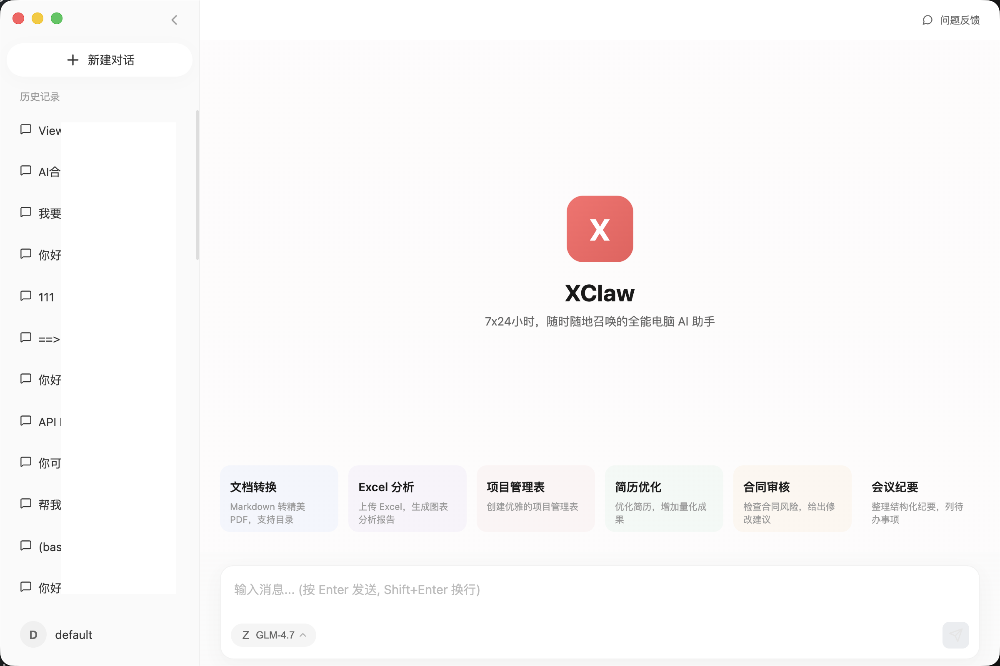
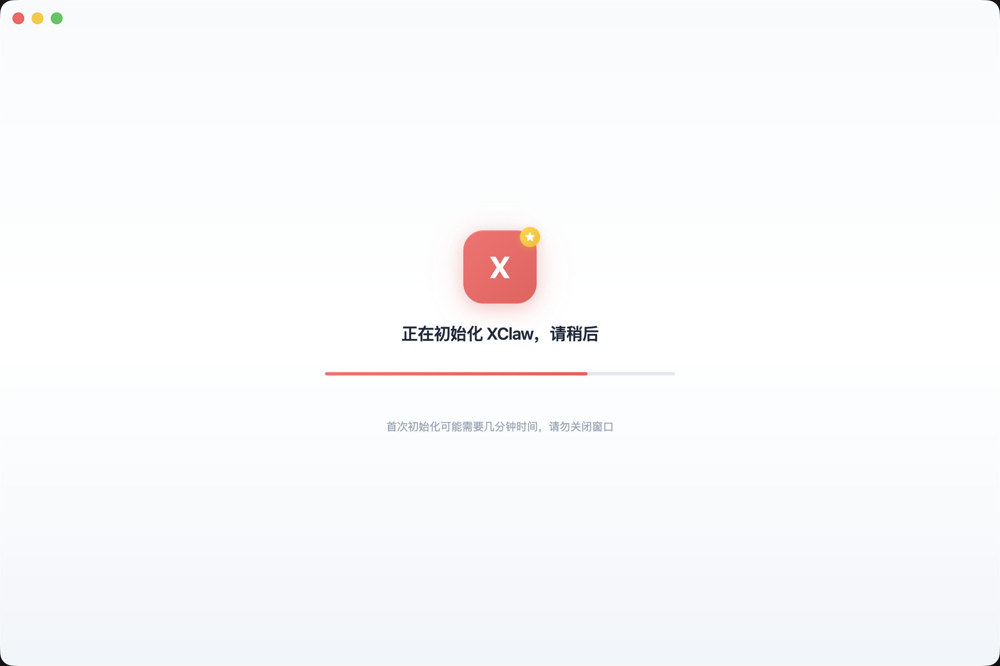
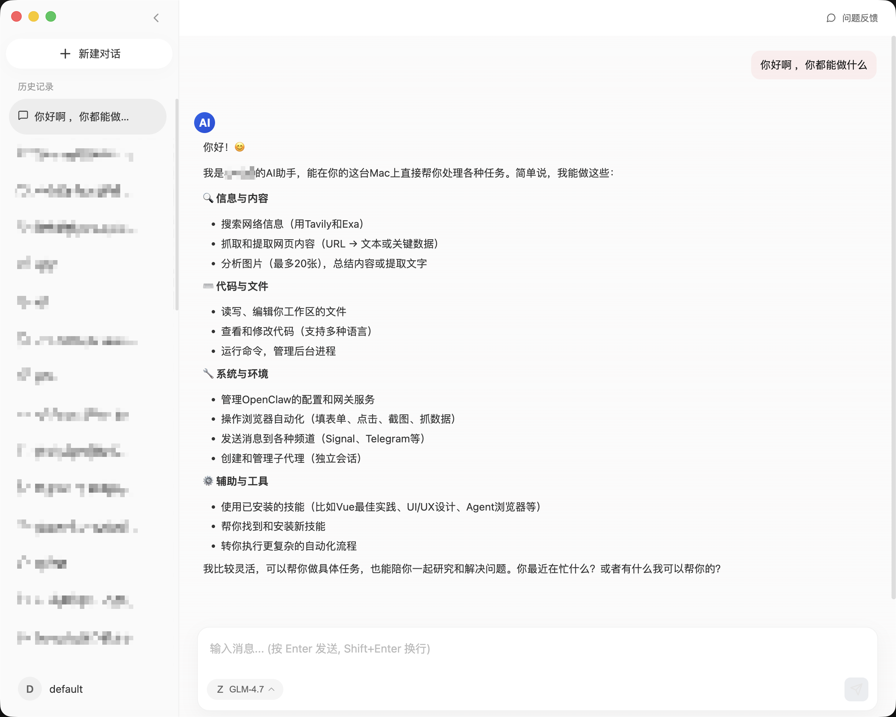
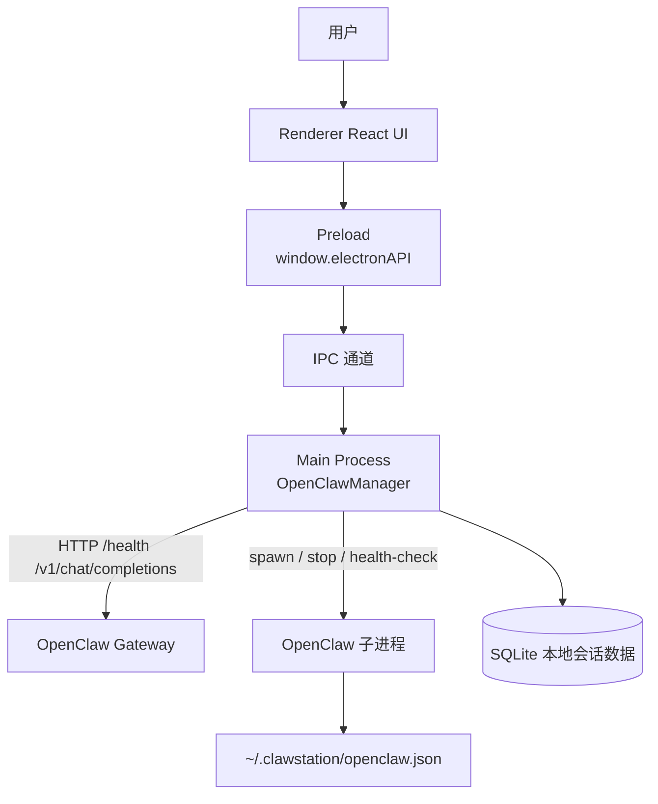

# X-Claw - 本地 AI 数字员工桌面应用

[](https://opensource.org/licenses/MIT)
[](https://github.com/ningblue/clawstation/releases)
[](https://github.com/ningblue/clawstation/actions)

<p align="center">
  
</p>

> 面向开发者的本地 AI 对话桌面应用，数据留在本地，模型可自由选择

## 🎯 核心定位

X-Claw 是一款**本地运行**的 AI 桌面应用，与纯云端 AI 应用不同：

| 对比 | X-Claw | 纯云端 AI 应用 |
|------|--------|---------------|
| 数据存储 | ✅ 本地 SQLite | ❌ 上传云端 |
| 模型选择 | ✅ OpenClaw 生态（国内模型为主） | ❌ 服务商指定 |
| 典型用户 | 开发者、个人技术用户 | 通用用户 |

**不提供**：企业私有化部署方案、Linux 官方发行版

**提供**：开发者可自行接入企业模型、个人使用灵活切换模型

## 📸 功能预览

### 应用初始化 - 快速配置模型
<p align="center">
  
</p>

### AI 智能对话
<p align="center">
  
</p>

## ✨ 功能特性

- 💾 **本地数据存储** - 聊天记录、会话数据存储在本地 SQLite，不上传云端
- 🤖 **内置 OpenClaw 引擎** - 集成 OpenClaw Core，自动管理模型和 API 配置
- 🌏 **支持多种模型** - 通过 OpenClaw 接入主流 AI 服务商（MiniMax、Kimi、Qwen、Doubao 等）
- 🔧 **开发者友好** - 开放架构，可配置自定义模型接入点
- 🛡️ **安全可控** - 本地数据处理，无外传风险
- 💬 **会话管理** - 支持会话分组、搜索、导出

## 💬 支持的模型

X-Claw 通过 OpenClaw 接入 AI 模型，支持的模型取决于 OpenClaw 配置：

| 提供商 | 说明 |
|--------|------|
| MiniMax | MiniMax AI |
| Moonshot / Kimi | Moonshot AI (Kimi) |
| Qwen | 阿里通义千问 |
| Doubao | 字节豆包 |
| Volcengine | 火山引擎 |
| Bailian | 百练 |
| StepFun | 阶跃星辰 |
| Z.AI / ZAI | Z.AI |
| Ollama | 本地 Ollama 模型 |
| vLLM | 本地 vLLM 模型 |
| 以及其他 OpenClaw 支持的模型... | |

> 详见 [OpenClaw 文档](https://docs.openclaw.ai)

## 📋 系统要求

- Windows 10+ / macOS 11+
- 至少 4GB 内存
- 至少 2GB 可用磁盘空间

## 🚀 快速开始

### 下载安装

从 [Releases](https://github.com/ningblue/clawstation/releases) 页面下载安装包：

- **macOS**: `X-Claw-x.x.x.dmg`
- **Windows**: `X-Claw-Setup-x.x.x.exe`

### 开发环境

#### 前提条件

- Node.js 22+
- Git

#### 安装步骤

```bash
# 1. 克隆项目
git clone https://github.com/ningblue/clawstation.git
cd clawstation

# 2. 获取 OpenClaw 依赖
mkdir -p lib
git clone --depth 1 https://github.com/openclaw/openclaw.git lib/openclaw

# 3. 安装 npm 依赖
npm install

# 4. 构建 OpenClaw
npm run build:openclaw

# 5. 启动开发模式
npm run dev
```

### Docker 构建 (可选)

```bash
# macOS
docker build -t clawstation-builder -f Dockerfile.macos .
docker run -v $(pwd)/release:/app/release clawstation-builder

# Windows
docker build -t clawstation-builder -f Dockerfile.windows .
docker run -v $(pwd)/release:/app/release clawstation-builder
```

### 构建发布包

```bash
npm run build:mac   # macOS
npm run build:win    # Windows
```

构建产物位于 `release/` 目录。

## 🏗️ 项目结构

```
clawstation/
├── src/
│   ├── main/              # Electron 主进程
│   ├── preload/           # 预加载脚本
│   ├── renderer/         # React 前端界面
│   ├── backend/          # 后端服务
│   │   └── services/     # 业务逻辑
│   ├── api/              # IPC 处理器
│   └── data/             # 数据库
├── resources/            # 静态资源
├── .github/workflows/    # GitHub Actions
├── package.json
├── electron-builder.yml
└── tsconfig.json
```

## 🔌 技术架构

### 当前架构



### 技术栈

- **框架**: Electron 40
- **前端**: React 18 + TypeScript + Tailwind CSS
- **数据库**: Better-SQLite3
- **AI 引擎**: OpenClaw Core

## 📄 许可证

[MIT License](./LICENSE) © X-Claw Team

## 🔗 相关链接

- [OpenClaw 文档](https://docs.openclaw.ai)
- [问题反馈](https://github.com/ningblue/clawstation/issues)
- [发布日志](https://github.com/ningblue/clawstation/releases)
